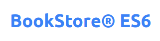
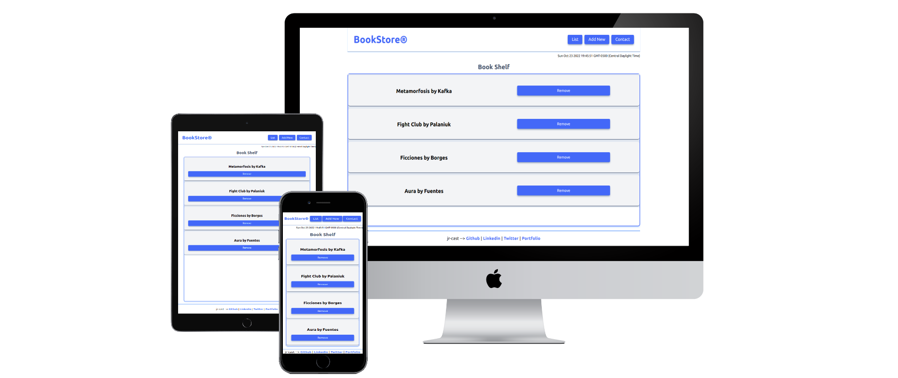

<div align="center">

  
  <h1>Vanilla Bookstore</h1>
    
<!-- Badges -->
<p>
  <a href="https://github.com/jr-cast/bookstore/graphs/contributors">
    
  </a>
  <a href="">
    
  </a>
  <a href="https://github.com/jr-cast/bookstore/network/members">
    
  </a>
  <a href="https://github.com/jr-cast/bookstore/stargazers">
    
  </a>
  <a href="https://github.com/jr-cast/bookstore/issues/">
    
  </a>
  <a href="https://github.com/jr-cast/bookstore/blob/master/LICENSE">
    
  </a>
</p>
   
<h4>
    <a href="https://vanilla-bookstore.netlify.app/">View Demo</a>
  <span> · </span>
    <a href="https://github.com/jr-cast/bookstore">Documentation</a>
  <span> · </span>
    <a href="https://github.com/jr-cast/bookstore/issues/">Report Bug</a>
  <span> · </span>
    <a href="https://github.com/jr-cast/bookstore/issues/">Request Feature</a>
</h4>
</div>

<br />

<!-- About the Project -->
## :star2: About the Project


<!-- Screenshots -->
### :camera: Screenshots

<div align="center"> 
  
</div>


<!-- TechStack -->
### :space_invader: Tech Stack

<details>
  <summary>Client</summary>
  <ul>
    <li><a href="https://developer.mozilla.org/en-US/docs/Web/HTML">HTML</a></li>
    <li><a href="https://www.javascript.com/">JavaScript</a></li>
    <li><a href="https://tailwindcss.com/">TailwindCSS</a></li>
  </ul>
</details>

<details>
  <summary>Database</summary>
  <ul>
    <li><a href="https://developer.mozilla.org/en-US/docs/Web/API/Window/localStorage">Local Storage</a></li>
  </ul>
</details>

<!-- Features -->
### :dart: Features

- Fully responsive: mobil, table, laptop & desktop
- Save books
- Delete books
- SPA

<!-- Getting Started -->
## 	:toolbox: Getting Started


<!-- Installation -->
### :gear: Installation

Install my-project with npm

```bash
  npm install
```

<!-- Run Locally -->
### :running: Run Locally

Clone the project

```bash
  git clone https://github.com/jr-cast/bookstore.git
```

Go to the project directory

```bash
  cd my-project
```

Install dependencies

```bash
  npm install
```

Start the server

* To start server please use LiveServer extension

<!-- Contributing -->
## :wave: Contributing

<a href="https://github.com/Louis3797/awesome-readme-template/graphs/contributors">
  
</a>


Contributions are always welcome!

See `contributing.md` for ways to get started.


<!-- License -->
## 🚩 License

Distributed under the MIT license. See LICENSE for more information.


<!-- Contact -->
## :handshake: Contact

👤 **Author**

- GitHub: [@jr-cast](https://github.com/jr-cast)
- Twitter: [@josercastanos](https://twitter.com/josercastanos)
- LinkedIn: [@jr-cast](https://linkedin.com/in/jr-cast)
- Portfolio: [@jr-cast.dev](https://jr-cast.dev)
